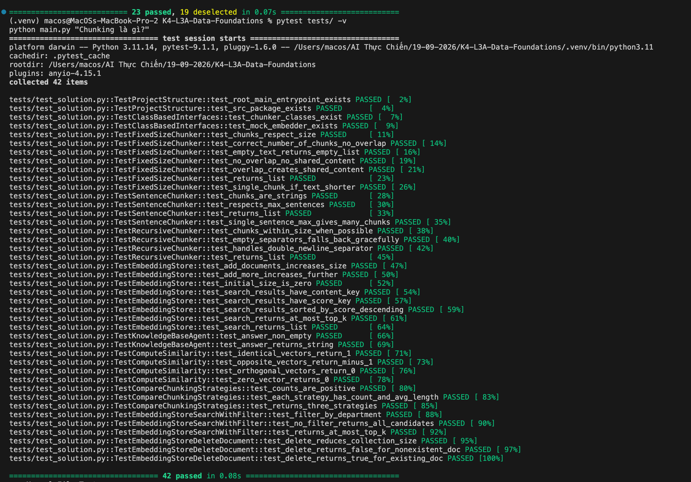

# Báo Cáo Cá Nhân — Lab 7: Embedding & Vector Store

**Họ tên:** Hoàng Anh Tài
**Nhóm:** G09
**Ngày:** 19-09-2026

> **Nộp 1 bản / sinh viên.** Phần nhóm (lựa chọn tài liệu, thiết kế chiến lược, bộ câu hỏi đánh giá, demo) nộp chung 1 bản trong `REPORT_NHOM.md`. Chi tiết thang điểm: `docs/SCORING.md`.

**Tổng điểm phần cá nhân: 60** = Khởi động (5) + Hướng tiếp cận (10) + Hoàn thiện code (30) + Dự đoán độ tương tự (5) + Kết quả truy xuất của tôi (10).

---

## 1. Khởi động (Warm-up) — Cá nhân (5 điểm)

### Độ tương tự Cosine (Cosine Similarity) (Bài tập 1.1)

**Độ tương tự cosine cao (High cosine similarity) nghĩa là gì?**
> *Viết 1-2 câu:* Độ tương tự cosine cao nghĩa là góc giữa hai vector hẹp (gần bằng 0), biểu thị hai đoạn văn bản có ý nghĩa ngữ nghĩa (semantic meaning) rất giống nhau hoặc liên quan mật thiết đến nhau, bất kể độ dài ngắn của chúng.

**Ví dụ có độ tương tự CAO:**
- Câu A: "Tôi rất thích ăn phở bò."
- Câu B: "Phở bò là món ăn yêu thích nhất của tôi."
- Tại sao tương đồng: Dù cách diễn đạt và từ ngữ có sự khác biệt, cả hai câu đều mang cùng một ý nghĩa cốt lõi là người nói có sở thích ăn món phở bò.

**Ví dụ có độ tương tự THẤP:**
- Câu A: "Tôi rất thích ăn phở bò."
- Câu B: "Hôm nay thời tiết ở Hà Nội thật đẹp."
- Tại sao khác: Hai câu đề cập đến hai chủ đề hoàn toàn độc lập (sở thích ăn uống và thời tiết), không có điểm chung nào về ngữ nghĩa.

**Tại sao độ tương tự cosine (cosine similarity) được ưu tiên hơn khoảng cách Euclid (Euclidean distance) cho text embeddings?**
> *Viết 1-2 câu:* Cosine similarity chỉ quan tâm đến hướng của vector thay vì độ lớn (magnitude), điều này rất quan trọng vì trong NLP, hai văn bản có cùng ý nghĩa nhưng độ dài khác nhau sẽ có độ lớn vector khác nhau; góc giữa chúng (cosine) sẽ phản ánh đúng sự tương đồng ngữ nghĩa hơn là khoảng cách tuyệt đối (Euclid).

### Bài toán tính toán Chunking (Bài tập 1.2)

**Tài liệu 10,000 ký tự, chunk_size=500, overlap=50. Bao nhiêu chunks?**
> *Trình bày phép tính:* Bước nhảy (stride) = chunk_size - overlap = 500 - 50 = 450 ký tự. Chunk đầu tiên lấy 500 ký tự, còn lại 10.000 - 500 = 9.500 ký tự. Số lượng chunk tiếp theo cần thiết để phủ hết phần còn lại là làm tròn lên của (9.500 / 450) = ceil(21.11) = 22 chunk.
> *Đáp án:* Tổng cộng 1 + 22 = 23 chunks.

**Nếu độ chồng chéo (overlap) tăng lên 100, số lượng chunk thay đổi thế nào? Tại sao muốn độ chồng chéo nhiều hơn?**
> *Viết 1-2 câu:* Số lượng chunk sẽ tăng lên (25 chunks) vì mỗi bước nhảy bị ngắn lại (còn 400 ký tự). Ta muốn độ chồng chéo nhiều hơn để đảm bảo ngữ cảnh (context) ở các phần ranh giới không bị đứt đoạn, giúp thông tin và ngữ nghĩa được bảo toàn trọn vẹn khi embedding.

---

## 2. Hướng tiếp cận của tôi (My Approach) — Cá nhân (10 điểm)

Giải thích cách tiếp cận của bạn khi lập trình (implement) các phần chính trong gói `src`.

### Các hàm chia nhỏ (Chunking Functions)

**`SentenceChunker.chunk`** — hướng tiếp cận:
> Dùng biểu thức chính quy `(?<=[.!?])\s+` với lookbehind để nhận diện khoảng trắng theo sau dấu kết thúc câu, giúp quá trình tách không làm nuốt mất các dấu câu `.` `!` `?`. Sau đó nhóm các câu lại theo `max_sentences_per_chunk` và xử lý khoảng trắng.
> *Edge case chưa xử lý được:* Mã code này sẽ cắt sai ở các chữ viết tắt có dấu chấm (như "TS.", "ThS.", "TP.HCM.") hoặc tên riêng có chấm (như "J.K. Rowling") vì nó lầm tưởng đó là kết thúc câu. Ngoài ra, nếu trong văn bản có dấu chấm lửng (e.g., `...`) và có khoảng trắng sau đó, nó cũng có thể bị tách chưa chuẩn xác nhất.

**`RecursiveChunker.chunk` / `_split`** — hướng tiếp cận:
> Đệ quy cắt văn bản theo các dấu phân cách từ lớn (dấu enter kép) đến nhỏ. Base case gồm 3 trường hợp: (1) đoạn văn đã ngắn hơn `chunk_size`, (2) đã hết separator, (3) separator là rỗng. Trong vòng lặp, thuật toán ghép (merge) các mảnh nhỏ lại với nhau cho tới khi chạm giới hạn `chunk_size` để không sinh ra các chunk bị quá vụn.

### Lớp EmbeddingStore

**`add_documents` + `search`** — hướng tiếp cận:
> `add_documents` gọi hàm tạo record (`_make_record`), tính vector embedding và đưa vào bộ nhớ in-memory (dạng danh sách dictionary). Hàm `search` sẽ duyệt qua danh sách, tính cosine similarity (qua `_dot`) với vector query, sắp xếp giảm dần và lấy ra `top_k`.

**`search_with_filter` + `delete_document`** — hướng tiếp cận:
> `search_with_filter` áp dụng cơ chế pre-filtering (lọc trước rồi mới tìm kiếm). Ta duyệt toàn bộ store và giữ lại những chunk khớp metadata trước khi gọi hàm search, nhằm tránh tình trạng các chunk sai chiếm hết k slot đầu. `delete_document` sử dụng list comprehension để lọc và tạo lại danh sách mới không chứa `doc_id` tương ứng.

### Tác tử KnowledgeBaseAgent

**`answer`** — hướng tiếp cận:
> Kiểm tra store rỗng trước để tiết kiệm API call. Gọi search lấy `top_k` chunk, gán cho mỗi chunk một số thứ tự `[1]`, `[2]` kèm nguồn (`source_url`). Prompt ra lệnh gắt gao LLM chỉ dùng ngữ cảnh được cấp, bắt buộc trích dẫn nguồn `[i]` và báo rõ "tôi không biết" nếu thông tin không có.

---

## 3. Hoàn thiện code (Core Implementation) — Cá nhân (30 điểm)

Vượt qua bộ kiểm thử là điều kiện tính điểm phần này.

### Kết Quả Kiểm Thử (Test Results)

```

```

**Số lượng bài test vượt qua (pass):** 42 / 42

---

## 4. Dự đoán độ tương tự (Similarity Predictions) — Cá nhân (5 điểm)

| Cặp | Câu A | Câu B | Dự đoán | Điểm thực tế | Đúng? |
|------|-----------|-----------|---------|--------------|-------|
| 1 | | | cao / thấp | | |
| 2 | | | cao / thấp | | |
| 3 | | | cao / thấp | | |
| 4 | | | cao / thấp | | |
| 5 | | | cao / thấp | | |

**Kết quả nào bất ngờ nhất? Điều này nói gì về cách embeddings biểu diễn ý nghĩa?**
> *Viết 2-3 câu:*

---

## 5. Kết quả truy xuất của tôi (Competition Results) — Cá nhân (10 điểm)

Chạy **5 câu hỏi đánh giá của nhóm** trên mã nguồn cá nhân của bạn trong gói `src`. **5 câu hỏi này phải trùng với các thành viên cùng nhóm** (xem `REPORT_NHOM.md`).

**Embedder:** `sentence-transformers/paraphrase-multilingual-MiniLM-L12-v2` (local) | **Chunker:** `HeadingChunker(chunk_size=500)` | **36 chunks** từ 7 files

| # | Câu hỏi (Query) | Top-1 Chunk truy xuất được (tóm tắt) | Điểm Score | Có liên quan không? (Relevant) | Câu trả lời của Agent (tóm tắt) |
|---|-------|--------------------------------|-------|-----------|------------------------|
| 1 | HB KKHT loại A tính thế nào? *(filter: audience=student)* | `criteria-student` — "Mức HB KKHT" (DOC✅ SNIPPET✅) | 0.7708 | 🟢 2/2 — Top-1 đúng doc + chứa "1,5 lần" | Loại A = 1,5 lần mức HB loại khá |
| 2 | SV K67–K70 cần ĐK gì để xét HB Trần Đại Nghĩa? | `council-staff` — "HĐ xét cấp HB KKHT" (sai doc) | 0.7676 | 🔴 0/2 — Gold doc ở top-3 nhưng chunk không chứa "2,0" | GPA ≥ 2,0; ĐRL ≥ 50; CTĐT chuẩn |
| 3 | SV đăng ký xét HB TĐN ở đâu, trước ngày nào? | `tran-dai-nghia` — "Hồ sơ đăng ký" (DOC✅) | 0.7682 | 🟢 2/2 — Top-1 đúng doc + top-2 chứa "phòng 102" | eHUST, phòng 102 C1, trước 09/10/2026 |
| 4 | SV bị CAHT có được xét HB KKHT không? *(filter: audience=student)* | `eligibility-2025-2` — "Lưu ý đối với SV" (sai doc) | 0.7291 | 🟡 1/2 — Gold doc ở top-2, chứa snippet | Không — CAHT mức 1 trở lên → không xét |
| 5 | Kết quả xét HB KKHT kỳ II: bao nhiêu SV mỗi loại? | `results-2025-2` — "Kết quả xét cấp" (DOC✅ SNIPPET✅) | 0.8424 | 🟢 2/2 — Top-1 đúng doc + chứa "1.343" | 1.343 A, 456 B, 89 C. Tổng 1.888 SV |

**Tổng điểm 2-mức:** 7 / 10 | **Bao nhiêu câu có chunk liên quan trong top-3?** 4 / 5

### A/B Test: metadata filter có giúp ích không?

| Câu | Có filter | Không filter | Filter giúp? |
|-----|-----------|-------------|---------------|
| Q1 (audience=student) | 🟢 2/2 — top-1 = `criteria-student` | 🟡 1/2 — top-1 = `council-staff` (0.7716), gold ở top-2 | ✅ Filter loại doc staff, đẩy gold lên top-1 |
| Q4 (audience=student) | 🟡 1/2 — top-1 = `eligibility`, gold ở top-2 | 🔴 0/2 — top-3 toàn `council-staff` + `eligibility`, gold biến mất | ✅ Filter cứu gold vào top-3 (dù chưa lên top-1) |

→ **Metadata filter giúp ích rõ rệt** ở cả 2 câu. Không lọc → doc `council-staff` (audience=staff) chiếm slot vì cùng từ vựng KKHT nhưng sai đối tượng.

### Phân tích lỗi (Failure Analysis)

**Q2 (0/2) — Chunker cắt đúng doc nhưng sai section:**
- Gold doc `tran-dai-nghia` lọt top-3 nhưng chunk trả về là mục "4. Quy trình đăng ký", không phải mục "b) SV K67–K70" chứa "≥ 2,0".
- Cosine đo độ giống chủ đề, không đo mật độ thông tin trả lời được. Các section trong cùng doc có score gần bằng nhau (0.69–0.77), section nào lọt top gần như ngẫu nhiên.
- **Đề xuất:** Tăng chunk_size hoặc thêm overlap để chunk chứa đáp án có thêm ngữ cảnh.

**Q4 (1/2) — Doc khác chiếm top-1:**
- `eligibility-2025-2` (audience=student) chứa từ "xét học bổng", "điều kiện" → embedding rất gần câu hỏi, dù không chứa quy định về cảnh báo học tập.
- **Đề xuất:** Cải thiện câu hỏi cụ thể hơn ("theo Quyết định 2124/QĐ-ĐHBK") hoặc dùng category filter.

**Điều hay nhất tôi học được từ thành viên khác / nhóm khác (qua demo):**
> *Viết 2-3 câu:*

---

## Tự Đánh Giá (Phần Cá Nhân)

| Tiêu chí | Điểm tự đánh giá |
|----------|-------------------|
| Khởi động (Warm-up) | / 5 |
| Hướng tiếp cận của tôi (My Approach) | / 10 |
| Hoàn thiện code (Core Implementation — tests) | / 30 |
| Dự đoán độ tương tự (Similarity Predictions) | / 5 |
| Kết quả truy xuất của tôi (Competition Results) | / 10 |
| **Tổng phần cá nhân** | **/ 60** |
